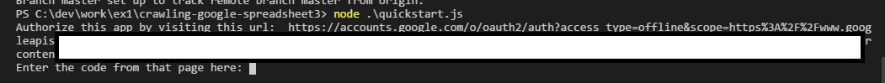
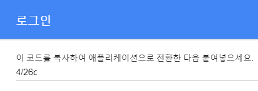
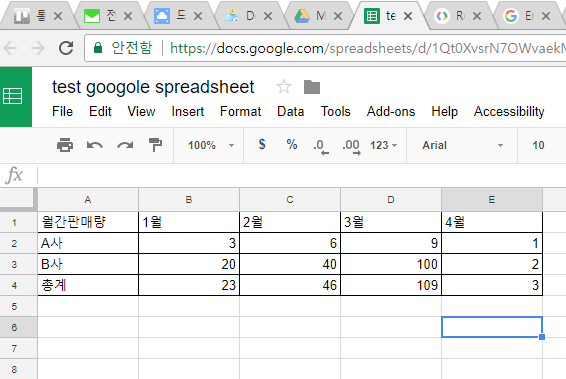
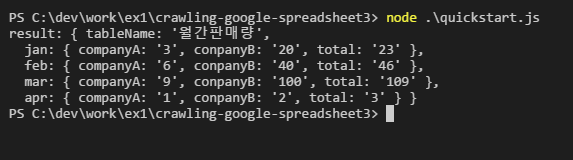

## 구글 스프레드시트에서 데이터를 가져오는 예제

### 0. 구글 스프레드시트에 접근하기 위해 필요한 것.

 - client_secret.json
 - spread sheet id


### 1. 구글 계정에서 설정이 필요하다.

 -  구글 계정에서 [여기](https://console.developers.google.com/flows/enableapi?apiid=sheets.googleapis.com)를 클릭해서 프로젝트를 만든다.Continue를 클릭하고, Go to credentials를 클릭한다. 

 - Add credentials to your project페이지에서, Cancel을 누른다.

 - 상단 OAuth consent screen에서, 구글 계정의 Email을 선택하고, Product name을 넣어준 후 Save한다.

 - Credendials 탭에서 Create credentials를 누르고, OAuth client ID를 선택한다. 

 - Application type을 Other로 선택하고, 적당한 이름을 넣어준다. 여기서는 이름을 구글 API Quick 예제처럼 **"Google Sheets API Quickstart"**로 명명 후 Create한다. 

 - ID와 secret을 알려주는 팝업창이 뜨면 OK를 누른다.

 - client ID를 JSON으로 다운받고, 엑셀 파싱을 진행할 work 디렉토리에 넣어준다. JSON 파일을 **"client-secret.json"**으로 바꾼다. 

### 2. work 디렉토리 준비

 적당한 곳에, 적당한 이름으로 work 디렉토리를 생성한다.

 ````shell
 $ mkdir work
 $ cd work
 ````

 필요한 모듈을 설치한다.
 ````shell
 $ npm i --save googleapis 
 $ npm i --save google-auth-library 
 ````

 ### 3. 샘플 코드

 다음은 구글 API Quick 예제에서 제공하는 소스코드 중 수정해야 할 부분을 설명한다. 전체 코드를 보고 싶다면 아래 참고에서 사용하길 바란다. 

```javascript

// Load client secrets from a local file.
fs.readFile('client_secret.json', function processClientSecrets(err, content) {
  if (err) {
    console.log('Error loading client secret file: ' + err);
    return;
  }
  // Authorize a client with the loaded credentials, then call the
  // Google Sheets API.
  authorize(JSON.parse(content), listMajors);
});

``` 
위의 코드에서 **'client_secret.json'**을 볼 수 있다. 아까 1에서 json 키 파일의 이름을 바꿨는데, 그 이름이랑 일치해야 한다.


```javascript

function listMajors(auth) {
  var sheets = google.sheets('v4');
  sheets.spreadsheets.values.get({
    auth: auth,
    spreadsheetId: '1BxiMVs0XRA5nFMdKvBdBZjgmUUqptlbs74OgvE2upms',
    range: 'Class Data!A2:E',
  }, function(err, response) {
    if (err) {
      console.log('The API returned an error: ' + err);
      return;
    }
    var rows = response.values;
    if (rows.length == 0) {
      console.log('No data found.');
    } else {
     
      let result = {
      tableName: rows[0][0],
      jan: {
        companyA: rows[1][1],
        conpanyB: rows[2][1],
        total: rows[3][1]
      },
      feb: {
        companyA: rows[1][2],
        conpanyB: rows[2][2],
        total: rows[3][2]
      },
      mar: {
        companyA: rows[1][3],
        conpanyB: rows[2][3],
        total: rows[3][3]
      },
      apr: {
        companyA: rows[1][4],
        conpanyB: rows[2][4],
        total: rows[3][4]
      }
    };

    console.log('result:',result);
    }
  });
}

```
위에서, 

```javascript
spreadsheetId: '1BxiMVs0XRA5nFMdKvBdBZjgmUUqptlbs74OgvE2upms'
```
가 있다. 이것을 구글 스프레드시트 id 값에 맞게 넣어준다. 참고로, 구글 스프레드시트를 실행시켰을때,<br/>
https://docs.google.com/spreadsheets/d/1BxiMVs0XRA5nFMdKvBdBZjgmUUqptlbs74OgvE2upms/edit<br/>
주소창에 위와 같은 주소를 볼 수 있을 것이다. 여기서 중앙에 알아보기 힘든 문자열이 스프레드시트 id이다.

```javascript
range: 'Class Data!A1:E4',
```
는 스프레드시트를 읽을 범위이다.
그리고,

```javascript
 var rows = response.values;
    if (rows.length == 0) {
      console.log('No data found.');
    } else {
      console.log('Name, Major:');
      let result = {
      tableName: rows[0][0],
      jan: {
        companyA: rows[1][1],
        conpanyB: rows[2][1],
        total: rows[3][1]
      },
      feb: {
        companyA: rows[1][2],
        conpanyB: rows[2][2],
        total: rows[3][2]
      },
      mar: {
        companyA: rows[1][3],
        conpanyB: rows[2][3],
        total: rows[3][3]
      },
      apr: {
        companyA: rows[1][4],
        conpanyB: rows[2][4],
        total: rows[3][4]
      }
    };

    console.log('result:',result);
    }
```

부분이 있다. 여기서 rows가 스프레드 시트의 본문을 받아오는 부분이다. rows는 배열로 받아오는데, 위의 코드와 같이 json으로 유용하게 바꿀 수 있다.

### 4. 실행

```shell
node quickstart.js
```
최초실행시, 추가 인증이 필요하다. 콘솔에 url주소가 뜨는데, 인증하기 위해서, 콘솔에 나온 브라우저에 url주소로 이동한다. 



이동하면 로그인해라고 한다. 로그인 후, 아래 그림과 같이 코드를 볼 수 있다. 코드를 복사해서 콘솔에 그대로 입력한다.



아마 성공할 것이다.

### 5. 결과

아래와 같은 구글 스프레드시트에서 데이터를 가져올 것이다.

<br/>
아래와 같이, 구글 스프레드시트로부터 크롤링 된 데이터를 json으로 파싱할 수 있다.



### 6. 참고
[1] https://developers.google.com/sheets/api/quickstart/nodejs